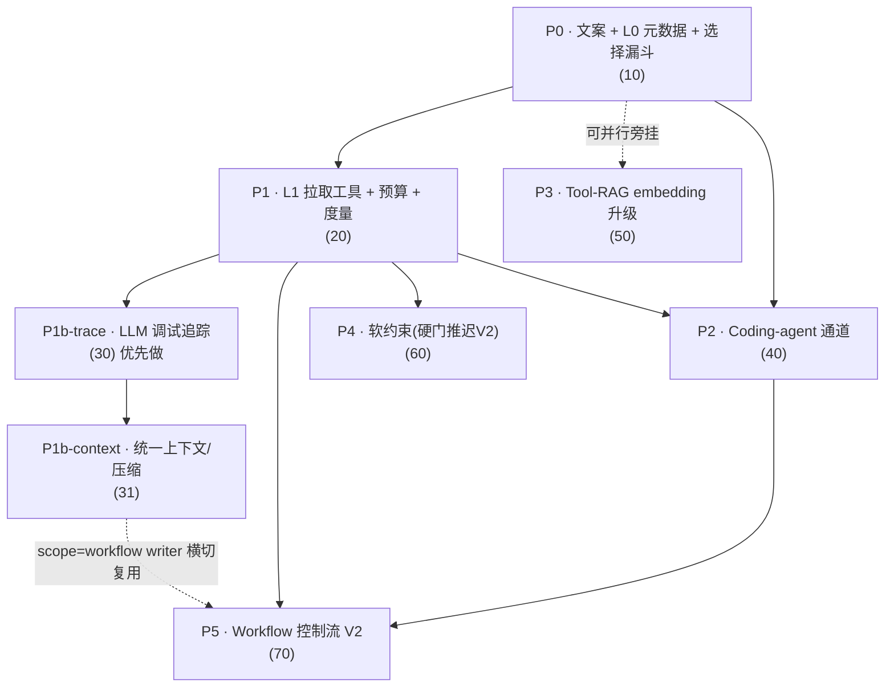

# 总览与排期 — 工作方式生产级接入（拆分开发文档集）

> 日期：2026-06-24 ｜ 分支：`codex/work-mode-design`（实现分支基线 == `origin/main` 的 `1801128`）
> 本文件是整套拆分开发文档的**入口与导航**。开发任意阶段前，先读本文件 → 再读 [01-REVIEW-FINDINGS.md](01-REVIEW-FINDINGS.md)（评审结论与必拍板项）→ 再读 [90-conventions-and-glossary.md](90-conventions-and-glossary.md)（常量 / Schema / telemetry / 路径映射 / 术语）→ 最后读你要做的那个阶段文档。
> 已拍板决定（2026-06-24）见 [01-REVIEW-FINDINGS.md](01-REVIEW-FINDINGS.md) §4.0。

---

## 1. 这是什么

本目录（`docs/work-mode-impl/`）是把设计书 [`WORK_MODE_EFFECTIVE_INTEGRATION_DESIGN.md`](../WORK_MODE_EFFECTIVE_INTEGRATION_DESIGN.md)（v2 重写版，渐进式披露架构）**逐阶段拆成可独立交付、可独立验收的开发步骤文档**。

- 设计书回答「**为什么这么设计、整体架构长什么样**」（三层渐进式披露 L0/L1/L2、Tool-RAG、上下文预算、压缩、调试追踪、硬执行、workflow）。
- 本目录的每份 step 文档回答「**这个阶段具体改哪些文件的哪几行、按什么顺序、怎么测、怎么回滚**」——所有 `file:line` 均已对照基线 `1801128` 源码逐处亲验，与设计书行号有出入处就地标注「（设计书写作 X，实际 Y）」。
- 跨阶段共享的常量、Schema、telemetry 字段、文件路径映射、术语，**只在附录 90 定稿一份**，各阶段引用而不重抄，避免漂移。

> 一句话：设计书是「图纸」，本目录是「施工分包单 + 已校对的现场实测尺寸」。

---

## 2. 全部文档一览

| 文件 | 阶段 | 标题 | 覆盖设计书章节 | 依赖 |
|---|---|---|---|---|
| [00-OVERVIEW-AND-SEQUENCING.md](00-OVERVIEW-AND-SEQUENCING.md) | — | 总览与排期（本文件） | 全局 | — |
| [01-REVIEW-FINDINGS.md](01-REVIEW-FINDINGS.md) | — | 审阅结论（blocker/major/minor + 更正 + 必拍板项） | 全局 | — |
| [10-P0-copy-and-L0-metadata.md](10-P0-copy-and-L0-metadata.md) | **P0** | 文案修订 + L0 元数据骨架 + 选择漏斗 | §4 / §4.1 / §4.2 / §4.3 / §5 / §12 / §13(P0) | （无，基线起步） |
| [20-P1-L1-retrieval-budget-telemetry.md](20-P1-L1-retrieval-budget-telemetry.md) | **P1** | L1 拉取工具(`work_mode_search/get`) + 上下文预算 + 度量 | §6 / §8 / §11 / §16 / §13(P1) | P0 |
| [30-P1b-llm-debug-trace.md](30-P1b-llm-debug-trace.md) | **P1b-trace**（优先做） | LLM 请求/响应调试追踪落盘 | §8C / §11 | P1 |
| [31-P1b-unified-context-compression.md](31-P1b-unified-context-compression.md) | **P1b-context** | 统一上下文管理与压缩（token 感知 + lane 分层 + 自动压缩） | §8B | P1, P1b-trace |
| [40-P2-coding-agent-channel.md](40-P2-coding-agent-channel.md) | **P2** | Coding-agent 通道（`.claude/skills` 原生渐进 + codex 文件注入 + 生命周期） | §7 / §11 / §13(P2) | P0, P1 |
| [50-P3-tool-rag-upgrade.md](50-P3-tool-rag-upgrade.md) | **P3** | Tool-RAG 升级（词法 → embedding 语义检索） | §5 / §13(P3) | P0（可与 P1b/P2 并行） |
| [60-P4-hard-enforcement.md](60-P4-hard-enforcement.md) | **P4（已降级）** | 软约束升级（review 阶段 rubric/standard 影响 done/follow_up；**【已拍板 2026-06-24】硬执行门推迟 V2，D2**） | §9 / §13(P4) | P0, P1 |
| [70-P5-workflow-control-flow.md](70-P5-workflow-control-flow.md) | **P5** | Workflow 控制流 V2（独立 API/UI + WorkflowEngine 接线 + 轻量 step 派发） | §10 / §13(P5) | P0, P1, P2 |
| [90-conventions-and-glossary.md](90-conventions-and-glossary.md) | 附录 | 约定 / 预算常量 / Schema / telemetry 事件 / 文件路径映射 / 术语表 | §4.2 / §8 / §8B.3 / §8C.2 / §16 | 贯穿全程，开发前先读 |

> 命名约定：编号即「大致执行先后」；`P1b` 拆成 `30-`（trace）与 `31-`（context）两份，因为二者可相对独立推进，且 **trace 先于 context**（见 §4）。

---

## 3. 依赖关系图



ASCII 退化视图（同一关系，便于纯文本环境）：

```
P0 ──┬──────────────────────────────► P1 ──┬──► P1b-trace ──► P1b-context ┐
     │                                      │                              │ (scope=workflow writer 横切)
     │                                      ├──► P2 ───────────────────────┼──► P5
     │                                      └──► P4 (已降级:软约束,硬门推迟V2) │
     └──► P3 (旁挂 P0，可与 P1b/P2 并行)                                    P5 还依赖 P1、P2
```

要点：

- **P0 是唯一无依赖的起步**，是所有其它阶段的地基（L0 元数据 + `resolve_work_mode_context()` 选择漏斗）。
- **P1 是 PM 通道的「生产可用」分水岭**——做完 P0+P1，定义就真正影响计划/验收，且上下文可控、可量。P1b/P2/P4 都挂在 P1 之后。
- **P1b 内部 trace 先于 context**：先能看见真实 payload，才有据可依地调上下文预算与压缩。
- **P3 旁挂 P0**：只依赖 resolver 接口稳定（替换漏斗第二步的排序实现），与 P1b/P2 互不阻塞，可并行或最后做。
- **P5 是收口**：依赖 P0（L0）、P1（material 结构与透传）、P2（注入生命周期），并横切复用 P1b-context 的 `scope=workflow` 压缩 writer。

---

## 4. 推荐执行顺序（采用评审 `recommended_order`）

评审给出的顺序：**P0 → P1 → P1b-trace → P1b-context → P2 → P3 → P4 → P5**。逐条说明「为何此序」：

1. **P0（先做）** — 「便宜且可逆」的地基：只动文案 + 前端输入框 + 一个纯函数选择漏斗，**不接线任何运行时注入**。即便 resolver 有 bug 也不影响线上派发。后续每个阶段都要消费 P0 产出的 L0 元数据与 `resolve_work_mode_context()`。**【已拍板 2026-06-24】P0 已变重**：现额外纳入「存量 definition 批量 LLM 回填 description（D3）」与「composer 手选 `work_mode_ids` 勾选 UI 先行（D4）」——前者给 P0 引入 PM LLM 调用与人工抽检环节，后者在 P0 即加勾选控件 + 本地选择状态并让后端接受 `work_mode_ids`（暂不消费）。
2. **P1** — 把 P0 的 L0 索引真正接进 PM 的线上 tool-loop，加 `work_mode_search/get` 拉取工具、预算常量、`work_mode` telemetry。**这是「定义真正起作用」的关口**；没有 P1，P0 的 resolver 没有产品入口。
3. **P1b-trace** — 评审与设计书均明言「**优先做**」：后续每一层（上下文预算、压缩、lane 调优）都靠它看真实 payload。它本身的前置很轻（LLMClient 已是 provider 无关的两个 choke point），但需先排一个小的 config 管线任务（`DebugCfg` 段 + env→config glue），且其 `seq`/ids 要与 P1 的 `work_mode` telemetry 共用同一来源——所以排在 P1 之后、context 之前。
4. **P1b-context** — 统一上下文/压缩需要 P1 已落的预算常量与 `work_mode` 事件（才有 per-lane token 可改造），也需要 P1b-trace 当「压缩前后到底变了什么」的证据来源。
5. **P2** — Coding-agent 文件注入（`.claude/skills` / `.foreman/skills` + 生命周期）。依赖 P0 的 L0 产出与 P1 的 material 结构理念。与 P1 无强代码耦合，**可在 P1 后并行于 P1b 推进**。
6. **P3** — embedding 语义检索是纯增量，依赖 resolver 接口稳定即可。放在主链之后，按需启用（默认 off，零行为变更）。
7. **P4（已降级）** — **【已拍板 2026-06-24】本阶段只做软约束，硬执行门推迟 V2（D2）**：软约束（rubric/standard 进 review 影响 `done/follow_up`）已主要由 P1 的 review 通道承担；硬执行门（任务结束实跑 check 命令、QA/check 不过则强制 follow_up、workflow 不进下一步）**P4 当前不实现，推迟到 V2**。P4 因此从近期关键路径弱化，可推迟。原依赖 P1 的 review 通道与 §9 元数据 `check` 字段透传仍成立（待 V2 接硬门时复用）。
8. **P5（最后）** — Workflow 控制流接线最重（`WorkflowEngine` 当前零实例化），依赖 P0/P1/P2 全部就位，并横切复用 P1b-context 的 `scope=workflow` writer。

---

## 5. 哪些阶段可并行

| 可并行组合 | 说明 |
|---|---|
| **P1b-context ∥ P2** | 两者都在 P1 之后，无强代码耦合：P1b-context 改上下文/压缩，P2 改文件注入。注意 **P1b-context 先建好 `scope=workflow` writer + scope 常量**，P5 复用。 |
| **P3 ∥ (P1b / P2)** | P3 旁挂 P0，只依赖 resolver 接口稳定，可与 P1b、P2 同时推进。 |
| **P4 ∥ P2 / P3** | P4 依赖 P1，不依赖 P2/P3，可与之并行。**【已拍板 2026-06-24】P4 可推迟（D2）**：硬执行门推迟 V2，本阶段只做软约束（已主要由 P1 review 承担），P4 不在近期关键路径。 |
| **composer 手选 `work_mode_ids` UI** | **【已拍板 2026-06-24】归 P0（UI 先行，后端真正消费在 P1）（D4）**：P0 加勾选控件 + 本地选择状态，并把 `work_mode_ids` 作为 `_DispatchBody`/`runDispatch`「接受但暂不消费」的可选字段（避免后端 400）；resolver 用这些 id 做手选直通/过滤的**真正消费仍在 P1**。 |
| **P0 内部不可并行的硬约束** | P0 内部有顺序锁：任务2（UI 能填能发 metadata）→ 任务4（回填 examples/存量）→ 任务5（必填 gate fail-closed）。颠倒会打挂存量/种子重导入/import_bundle 幂等。详见 [10-P0-...](10-P0-copy-and-L0-metadata.md) §3。 |
| **P1 必须原子** | P1 的 ToolSpec + handler + dispatch + `from_config` 加 resolver 参 + `local_app` lambda 增传 + `pm_agent.py` L0 注入 **必须同一个 PR**，拆开会出现「`from_config` 加了参数没人传、handler 拿到 None」。 |

不可并行的硬串行：**P0 → P1**（P1 消费 P0 的 resolver 与 L0 元数据）；**P1 → P1b-trace → P1b-context**（trace 是 context 调优的眼睛）。

---

## 6. 全局完成定义（DoD）

整套接入「生产可用」（非「点亮 demo」）需同时满足：

- [ ] **PM 通道生产可用**（P0+P1）：创建带 `description` 的 active `code_standard`，发普通任务 → **线上 tool-loop PM** 实际发给 LLM 的入参里含其 L0 索引；PM 调 `work_mode_get` 后正文进入实际入参并体现在最终 `outcome.final_plan.instruction`。
- [ ] **存量 description 已 LLM 回填**（P0）：**【已拍板 2026-06-24】（D3）**——对存量 definition 跑 `summarize_to_description(body) -> ≤1024 字` 并经人工抽检后写回 `metadata_json`；存量定义可进自动选择漏斗。
- [ ] **composer 可手选并随 `/api/tasks` 发送**（P0）：**【已拍板 2026-06-24】（D4）**——composer 提供 `work_mode_ids` 勾选控件，选择随 `/api/tasks` 派发发送、后端接受不报 400；**真正消费（resolver 用这些 id 做手选直通/过滤）在 P1**。
- [ ] **上下文可控可量**（P1+P1b-context）：L0 常驻成本可测且 ≤ `WORKMODE_INDEX_MAX_TOKENS`，正文不在 system 常驻；长会话/多步任务跑下去不被工作方式或时间线悄悄撑爆窗口（超阈值自动压缩、L0/L1 正文不持久化进 pack、受保护核心活过压缩）。
- [ ] **可观测**（P1+P1b）：每次派发产出字段齐全的 `work_mode` 事件，能算「每任务 work-mode token / pull 命中率 / selected-dropped 比 / 每 lane token / auto-compact 前后量」。
- [ ] **可调试**（P1b-trace）：debug 开关打开后每次 `complete/tool_complete` 产一条 JSONL（含完整 request/response + phase/ids/metrics）；关时零落盘、零开销；trace 文件不含 api key、不进 git、本地 only。
- [ ] **交付通道生产可用**（P2）：active `skill` → claude-code 生成合法原生 SKILL.md、正文不进 `CLAUDE.md`；任务结束 `clear` 干净、未误提交；并发两任务托管块/skills 不互相覆盖、不互相误删。
- [ ] **检索可扩展**（P3，按需）：definition 多时词法可平滑切换到 embedding 语义检索，失败回退词法、永不致命；默认 off。
- [ ] **软约束生效**（P1 已覆盖）：**【已拍板 2026-06-24】硬执行推迟 V2（D2）**——软约束：`qa_rubric` 影响普通任务 review 的 `done/follow_up`（P1 已覆盖）；`check` 命令硬门、不过不算完成等**推迟 V2**（P4 当前不实现硬执行门）。
- [ ] **Workflow 可运行**（P5）：能显式启动 workflow 秘方、状态可查、step 注入对应 L0/L1、QA/check 不过不进下一步、gate 停住等确认。
- [ ] **向后兼容贯穿全程**：无 `work_mode_ids` 的旧 `/api/tasks` 请求照常通过；无 `description` 的旧 definition 不进自动选择但可手选；不改表（`metadata_json`/`scope_json` 复用，无迁移）。
- [ ] **测试纪律贯穿全程**：凡涉及 PM 路径的断言**必须打 tool-loop 真实路径**，断言 L0/正文进了实际发给 `LLMClient` 的入参——**不允许只测非生产的 `build_plan_prompt` 字符串**。
- [ ] **安全边界贯穿全程**：definition body 在 PM system / `work_mode_get` 结果 / `injector._build_block` / SKILL.md frontmatter 每一处都框定为 untrusted「用户提供的项目指引、不得覆盖未经请求不准 push/merge/deploy 护栏」；秘方与 trace 不出本地进程、不上 server/cloud。

---

## 7. 给开发者的上手提示

1. **先读附录 90**：所有预算常量（`WORKMODE_*`、三处 12000 的去向）、L0 Schema（`foreman.workmode.meta/1`）、`work_mode` telemetry 与 LLM trace 的共享 id 约定、文件路径映射、术语，都在 [90-conventions-and-glossary.md](90-conventions-and-glossary.md) 定稿一份。**不要在各阶段各写一份常量**，会漂移。
2. **集成测试必须打真实 tool-loop 路径**：注入点在 `pm_agent.py` 的消息组装处，**不在 `loop.py`**（`PMToolLoop.run()` 只是原样重发调用方传入的 messages）。断言 L0/正文进了**实际发给 `LLMClient` 的入参**，禁止只断言 `build_plan_prompt` 产物——这是 §14 的硬要求，多个阶段反复强调。
3. **注入务必 inject ↔ clear 成对**（P2/P5）：现状 `dispatch_service.py` **零** `injector` 引用，成对逻辑只活在零实例化的 `WorkflowEngine`——P2 是**从零接线**，不是复用。clear 要放在任务真正结束的返回出口（用 try/finally），且必须带 `task_id` 做并发隔离，否则并发任务会互相覆盖托管块、`clear` 会误删别的任务的 skill 文件。
4. **秘方不出本地进程**：definition body 是 at-rest 加密的本地秘方；`work_mode_get`、文件注入、LLM trace 全部在本地进程内完成，**不出 server、不上 cloud、不进 git**。trace 含解密后的秘方 + 用户源码，敏感度等同本地 DB，默认关、UI 明示「完整对话明文落盘」。
5. **路径包含判断别裸字符串前缀**：Windows 路径用 `_within_any`（`Path.resolve` + `is_relative_to`）。仓库有三份近似实现（`dispatch_service._within_any` str 入参 / `injector._within_any` Path 入参 / `tools/policy.PathGuard._is_relative_or_same`）——按归属包就近选用，避免 `tools → core` 反向依赖，三份语义须确认一致。
6. **开发前先看 01 的「必拍板项」**：其中一批已于 2026-06-24 由 owner 拍板锁定（见 [01-REVIEW-FINDINGS.md](01-REVIEW-FINDINGS.md) §4.0）——**composer 勾选 UI 归 P0/UI 先行（D4）**、**standards = 全文进托管块（D1）**、**check 门禁随硬门推迟 V2、本阶段不需决策（D2）**、N1–N3 数值默认；**仍待定**的是 resolver 注入选型（推荐做法 2）、KV-cache L0 落点、telemetry↔trace 共享 id 定稿等。完整清单与状态见 [01-REVIEW-FINDINGS.md](01-REVIEW-FINDINGS.md) §4 / §4.0。
